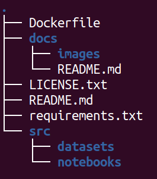

# Data Science Challenge

* Os códigos desenvolvidos para este desafio foram todos implementados em [notebooks jupyter](https://jupyter-notebook.readthedocs.io/en/stable/) usando a linguagem de programação [python](https://www.python.org/) e demais bibliotecas necessárias.
* Para que os códigos sejam reproduzíveis em qualquer sistema operacional foi utilizado o [Docker](https://www.docker.com/) para criar um _container_ que virtualiza um ambiente com todas as dependências necessárias para a reprodução.
* Note que a instalação e configuração do ambiente virtual somente se faz necessária caso queira reproduzir os códigos. Caso contrário, basta abrir os notebooks jupyter e visualizar os resultados. A própria plataforma do github permite a visualização dos notebooks, bastando clicar nos arquivos com extensão `.ipynb`.
* Nas instruções de instalação abaixo, o nome do _container_ é definido como `augusto-fonseca-container`. Tal decisão se alinha com os requisitos do desafio que orienta criar uma _branch_ com o nome do candidato.

# Instalação do ambiente virtual

## Requisitos
Para instalar o ambiente virtual é necessário ter o [Docker](https://www.docker.com/) >= 24.0.7 instalado na máquina. Versões anteriores podem funcionar, mas não foram testadas. Siga as instruções de instalação para o seu sistema operacional.

## Criação do ambiente virtual
Em um terminal do computador navegue até o diretório raiz do projeto, o diretório que contém o arquivo `Dockerfile`. A partir do diretório raiz execute os seguintes comandos para criar o ambiente virtual `(note que existe um ponto no final do primeiro comando que não deve ser omitido)`:

```bash
docker build -t python3.11 .

docker run -it --name augusto-fonseca-container -p 8888:8888 -v $(pwd):/home/projetos/data-science-challenge python3.11
```
Este procedimento só precisa ser executado uma vez. Após a criação do ambiente virtual, você verá um prompt de comando semelhante ao seguinte:

```bash
dockeruser@cba3f6d4e536:/home/projetos/data-science-challenge$
```

Para sair do _container_ basta executar o comando `exit` no terminal.

```bash
dockeruser@cba3f6d4e536:/home/projetos/data-science-challenge$ exit
```

# Reprodução dos códigos

Esta seção apresenta o passo a passo para reproduzir os códigos desenvolvidos para o desafio. Por ser uma etapa com um nível de dificuldade maior, foi preparado um vídeo que reproduz os passos descritos abaixo. O vídeo encontra-se em `docs/videos/jupyter.mp4`.

Caso o container não esteja em execução, execute os comandos abaixo para iniciar o _container_ e acessá-lo:

```bash
docker start augusto-fonseca-container

docker attach augusto-fonseca-container
```

Os códigos foram implementados em notebooks jupyter. Para reproduzir os códigos, inicie uma sessão do jupyter notebook com o comando abaixo `(executado dentro do _container_)`:

```bash
python -m notebook --ip 0.0.0.0 --port 8888 --allow-root
```

Fora do _container_, abra o navegador do seu computador e acesse o endereço `http://localhost:8888`. A interface do jupyter notebook será exibida. Caso seja solicitado o token de acesso, copie o token exibido no terminal do _container_ e cole no campo de texto da interface do jupyter notebook. Após a autenticação com o token, navegue até o diretório `src/notebooks` e abra o notebook desejado.

Caso tenha dúvidas sobre o uso do jupyter notebook, consulte a [documentação oficial](https://jupyter-notebook.readthedocs.io/en/stable/).

Para finalizar a sessão do jupyter notebook, pressione `Ctrl + C` no terminal do _container_ e confirme a finalização com `y`.

# Estrutura do projeto
* O projeto está estruturado conforme a imagem abaixo:



> * `Dockerfile`: arquivo de configuração do Docker para a criação do ambiente virtual.
> * `docs`: diretório com o arquivo de documentação.
> * `docs/README.md`: documentação técnica produzida como requisito do desafio.
> * `LICENSE.txt`: arquivo de licença do projeto.
> * `README.md`: documentação de orientação sobre o desafio.
> * `requirements.txt`: arquivo com as dependências do projeto.
> * `src`: diretório com os códigos fonte.
> * `src/datasets`: diretório com os dados disponibilizados para o desafio.
> * `src/datasets/staged`: diretório com os dados processados.
> * `src/notebooks`: diretório com os notebooks jupyter empregados na análise e processamento dos dados.
> * `.env`: arquivo com as variáveis de ambiente.
> * `.gitignore`: arquivo com as configurações de arquivos a serem ignorados pelo git.

* Foram implementados três jupyter notebooks para a análise e processamento dos dados:
> * `src/notebooks/load_optimize.ipynb`: responsável por carregar e otimizar os dados.
> * `src/notebooks/analysis.ipynb`: responsável pela análise exploratória dos dados e, por questões de simplicidade, para gerar o dataset pré-processado.
> * `src/notebooks/train_predict.ipynb`: responsável por treinar e avaliar os modelos de regressão, bem como estimar os valores de material e execução para o projeto 4 do desafio.

# Principais bibliotecas utilizadas

> * `numpy`, `pandas`: bibliotecas empregadas para análise, manipulação e processamento de dados.
> * `matplotlib`, `seaborn`: bibliotecas empregadas na visualização dos dados em forma de gráficos.
> * `statsmodels`, `scikit-learn`: bibliotecas empregadas na implementação dos modelos de regressão, além de outras funcionalidades como normalizadores e métricas de avaliação.
> * `jupyter`: biblioteca empregada para a implementação dos notebooks jupyter.
> * `fastparquet`: biblioteca empregada para otimizar os dados para o formato `parquet`.

Como boa prática em projetos de data science, os notebooks jupyter devem ser empregados apenas para análise e visualização de dados, enquanto que os scripts de processamento de dados e as APIs para chamada dos modelos devem ser implementados em arquivos python. No entanto, para fins de simplicidade e permitir a visualização dos resultados sem a necessidade de executar os códigos, todas as etapas foram implementadas em notebooks jupyter.
